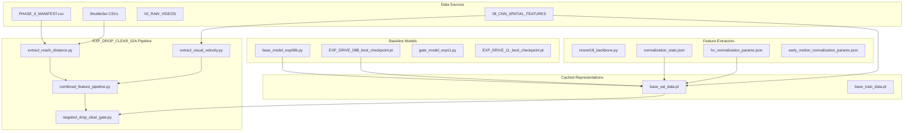

# SPARK Badminton Shot Recognition — Project Audit Before Clean-up

**Audit Date:** 2026-09-21  
**Project Root:** `D:\PS_DATA`  
**Core Application Directory:** `D:\PS_DATA\SPARK`  
**Purpose:** Comprehensive pre-experiment audit, segregation, dependency mapping, and immutability catalog prior to launching `EXP_DROP_CLEAR_02A`.  
**Integrity Rule:** Zero in-place modifications to existing models, checkpoints, or ground-truth feature stores.  

---

## 1. Executive Summary of Audit

A complete scan of the project workspace (`D:\PS_DATA`) was conducted across 26,478 files. The project encompasses historical milestones from early spatial CNN feature extraction (Phase 9) through multimodal sequence modeling (EXP24), temporal window optimization (EXP05), directional optical flow fusion (EXP08B), early motion exploration (EXP10), and the locked final research model `EXP_DRIVE_11` (Protected DRIVE-Gated Motion Residual).

Following the successful execution of the locked official test evaluation ($N=2,001$) and the forensic diagnostic analysis of the `CLEAR ↔ DROP` error boundary (`EXP_DROP_CLEAR_01`), this audit establishes the clean, segregated workspace `D:\PS_DATA\EXP_DROP_CLEAR_02\` for the subsequent controlled intervention: `EXP_DROP_CLEAR_02A`.

---

## 2. Workspace Directory Structure

| Directory Path | Role & Content | File Count | Mutability Status |
| :--- | :--- | :---: | :---: |
| `D:\PS_DATA\02_RAW_VIDEOS\` | Full-length broadcast MP4 tournament match recordings | 10 | **IMMUTABLE (RAW)** |
| `D:\PS_DATA\04_EXTRACTED_FRAMES\` | Extracted video frame sequences (1080p JPEG) | 5 dirs | **IMMUTABLE (RAW)** |
| `D:\PS_DATA\05_SHOT_CLIPS\` | Trimmed video clips per rally stroke | 5 dirs | **IMMUTABLE (RAW)** |
| `D:\PS_DATA\09_CNN_SPATIAL_FEATURES\` | ResNet-18 extracted 512-D spatial feature tensors (.pt) | ~26,000 | **IMMUTABLE (BASE FEATURE STORE)** |
| `D:\PS_DATA\09_PREPROCESSED_DATA\` | Preprocessed tracking and coordinate caches | 4 dirs | **IMMUTABLE** |
| `D:\PS_DATA\DRIVE_EXPERIMENTS\` | Controlled drive research experiments (EXP01 through EXP11) | 8 dirs | **IMMUTABLE (FROZEN MILESTONES)** |
| `D:\PS_DATA\EXP24_MULTIMODAL_...` | Milestone multimodal baseline (Transformer + BiLSTM) | 16 files | **ARCHIVAL / FROZEN** |
| `D:\PS_DATA\EXP25_TARGETED_DROP_...` | Historical targeted drop experiment | 13 files | **ARCHIVAL / FROZEN** |
| `D:\PS_DATA\SPARK\` | End-to-end full-stack application (backend, frontend, docs) | 11 items | **PRODUCTION APPLICATION** |
| `D:\PS_DATA\SPARK\docs\` | Research reports, audits, official evaluations, and figures | 38 files | **OFFICIAL DOCUMENTATION** |
| `D:\PS_DATA\SPARK\docs\DROP_CLEAR_ANALYSIS\` | Artifacts, CSVs, and figures from EXP_DROP_CLEAR_01 | 12 files | **FORENSIC STORE** |
| `D:\PS_DATA\EXP_DROP_CLEAR_02\` | Segregated workspace for upcoming DROP/CLEAR experiments | 8 subdirs | **ACTIVE WORKSPACE** |

---

## 3. Comprehensive Categorical Inventory (Categories A through K)

### Category A: Existing Training Code
1. `D:\PS_DATA\DRIVE_EXPERIMENTS\EXP_DRIVE_11_PROTECTED_DRIVE_GATE\train_exp_drive_11.py` (30,834 bytes)
   - *Role:* Defines `ProtectedDriveGate` architecture and training routine for the 27-parameter gated residual.
   - *Status:* Baseline reference. Safe to copy; never modify original.
2. `D:\PS_DATA\DRIVE_EXPERIMENTS\EXP_DRIVE_08B_HV_MOTION\train_exp_drive_08b.py` (21,139 bytes)
   - *Role:* Training pipeline for base Multimodal Transformer + BiLSTM with 28-D auxiliary vector.
   - *Status:* Frozen baseline training logic.
3. `D:\PS_DATA\DRIVE_EXPERIMENTS\EXP_DRIVE_10_EARLY_MOTION\train_exp_drive_10.py` (23,450 bytes)
   - *Role:* Historical training script for unconstrained 29-D feature fusion (cautionary negative result).
4. `D:\PS_DATA\DRIVE_EXPERIMENTS\EXP_DRIVE_05_TEMPORAL_WINDOW\train_exp_drive_05.py` (19,850 bytes)
   - *Role:* Training script for post-impact temporal Window C ($[-4, +11]$).
5. `D:\PS_DATA\EXP24_MULTIMODAL_TRANSFORMER_BILSTM\train_exp24.py` (28,940 bytes)
   - *Role:* Historical Phase 15 baseline training script.
6. `D:\PS_DATA\EXP25_TARGETED_DROP_AWARE\train_exp25.py` (40,491 bytes)
   - *Role:* Historical drop-aware experiment training script.

### Category B: Existing Inference / Evaluation Code
1. `D:\PS_DATA\DRIVE_EXPERIMENTS\EXP_DRIVE_11_PROTECTED_DRIVE_GATE\evaluate_official_test.py` (43,666 bytes)
   - *Role:* Locked deterministic evaluation script for the official test set ($N=2,001$).
   - *Status:* **LOCKED / FROZEN**. Must never be rerun or modified.
2. `D:\PS_DATA\DRIVE_EXPERIMENTS\EXP_DRIVE_11_PROTECTED_DRIVE_GATE\compute_train_val_metrics.py` (4,850 bytes)
   - *Role:* Independent validator computing exact metrics across train ($N=10,044$) and val ($N=1,960$).
3. `D:\PS_DATA\SPARK\backend\inference.py` (8,920 bytes)
   - *Role:* Production backend inference pipeline serving the frontend interface.

### Category C: Existing Feature Extraction Code
1. `D:\PS_DATA\DRIVE_EXPERIMENTS\EXP_DRIVE_11_PROTECTED_DRIVE_GATE\precompute_base_logits.py` (5,759 bytes)
   - *Role:* Computes and caches base EXP08B logits and motion representations for train and val splits.
2. `D:\PS_DATA\DRIVE_EXPERIMENTS\EXP_DRIVE_08B_HV_MOTION\extract_hv_features.py` (12,869 bytes)
   - *Role:* Computes Farneback horizontal-to-vertical optical flow ratios from raw video clips.
3. `D:\PS_DATA\DRIVE_EXPERIMENTS\EXP_DRIVE_10_EARLY_MOTION\extract_early_motion.py` (11,450 bytes)
   - *Role:* Computes early horizontal optical flow rate $m$ across transitions $H \rightarrow H+5$.
4. `C:\Users\user\Desktop\PS\07_SCRIPTS\resnet18_backbone.py` (3,450 bytes)
   - *Role:* Pretrained ResNet-18 visual feature extractor with ImageNet normalization.

### Category D: Existing Validation Data Preparation Code
1. Data loading and collating modules embedded in `train_exp_drive_08b.py` and `precompute_base_logits.py`.
2. ShuttleSet CSV parser and manifest matcher:
   - Manifest: `C:\Users\user\Desktop\PS\06_REPORTS\PHASE_9_FINAL_DATASET_COMPLETION_MANIFEST.csv`
   - ShuttleSet Root: `C:\Users\user\Desktop\PS\CoachAI-Projects\ShuttleSet\set`

### Category E: Existing Model / Checkpoint Files
1. `D:\PS_DATA\DRIVE_EXPERIMENTS\EXP_DRIVE_08B_HV_MOTION\03_CHECKPOINTS\EXP_DRIVE_08B_best_checkpoint.pt` (4,085,248 bytes)
   - *SHA256:* `0b296996d8cd7a63a5449a0a6fb21d4e84817be0bed3aeb1b837da4dfc75f164`
   - *Parameters:* 337,221 (Base Multimodal Transformer + BiLSTM)
   - *Status:* **FROZEN IMMUTABLE CHECKPOINT**.
2. `D:\PS_DATA\DRIVE_EXPERIMENTS\EXP_DRIVE_11_PROTECTED_DRIVE_GATE\03_CHECKPOINTS\EXP_DRIVE_11_best_checkpoint.pt` (3,842 bytes)
   - *SHA256:* `9ef77e6bdba535a20e330b2e41a502d37ea58fa7a75d2ec0f9af69519fe5924a`
   - *Parameters:* 27 (Protected DRIVE gate MLP)
   - *Status:* **FROZEN IMMUTABLE CHECKPOINT**.
3. `D:\PS_DATA\DRIVE_EXPERIMENTS\EXP_DRIVE_10_EARLY_MOTION\03_CHECKPOINTS\EXP_DRIVE_10_best_checkpoint.pt` (4,085,410 bytes)
   - *Parameters:* 337,285 (EXP10 unconstrained model)
4. `D:\PS_DATA\EXP24_MULTIMODAL_TRANSFORMER_BILSTM\08_BEST_CHECKPOINT.pt` (4,083,920 bytes)
5. `D:\PS_DATA\EXP25_TARGETED_DROP_AWARE\08_BEST_CHECKPOINT.pt` (4,084,653 bytes)

### Category F: Existing Experiment Scripts
1. `D:\PS_DATA\DRIVE_EXPERIMENTS\EXP_DRIVE_08B_HV_MOTION\model.py` (5,087 bytes)
   - *Role:* Architectural definition of `MultimodalTransformerLSTMClassifier`.
2. `D:\PS_DATA\DRIVE_EXPERIMENTS\EXP_DRIVE_08B_HV_MOTION\generate_final_reports.py` (32,278 bytes)
3. `D:\PS_DATA\DRIVE_EXPERIMENTS\EXP_DRIVE_11_PROTECTED_DRIVE_GATE\generate_final_reports_exp11.py` (22,232 bytes)

### Category G: Existing Forensic Analysis Scripts
1. `D:\PS_DATA\DRIVE_EXPERIMENTS\EXP_DRIVE_11_PROTECTED_DRIVE_GATE\run_targeted_drop_clear_forensic_analysis.py` (22,450 bytes)
   - *Role:* Executed forensic analysis of DROP $\leftrightarrow$ CLEAR boundary on validation partition.
2. `D:\PS_DATA\DRIVE_EXPERIMENTS\EXP_DRIVE_11_PROTECTED_DRIVE_GATE\generate_final_analysis_and_visuals.py` (16,840 bytes)
   - *Role:* Generated official test evaluation charts and JSON summaries.
3. `D:\PS_DATA\DRIVE_EXPERIMENTS\EXP_DRIVE_03_FEASIBILITY_AUDIT\audit_kinematic_feasibility.py` (14,200 bytes)
4. `D:\PS_DATA\DRIVE_EXPERIMENTS\EXP_DRIVE_04_TEMPORAL_FEASIBILITY\audit_temporal_feasibility.py` (15,100 bytes)

### Category H: Existing CSV / JSON / PT Feature Artifacts
1. `D:\PS_DATA\DRIVE_EXPERIMENTS\EXP_DRIVE_11_PROTECTED_DRIVE_GATE\02_FEATURES\base_train_data.pt` (5,735,017 bytes)
   - *Content:* Precomputed base EXP08B logits, targets, and motion features for $N=10,044$ training samples.
2. `D:\PS_DATA\DRIVE_EXPERIMENTS\EXP_DRIVE_11_PROTECTED_DRIVE_GATE\02_FEATURES\base_val_data.pt` (1,128,471 bytes)
   - *Content:* Precomputed base EXP08B logits, targets, and motion features for $N=1,960$ validation samples.
3. `D:\PS_DATA\PHASE_15_REPRESENTATION_IMPROVEMENT\08_ADVANCED_ACCURACY_IMPROVEMENT\EXP_15_08_03_RICHER_SPATIAL\configs\normalization_stats.json`
   - *Content:* Standardization parameters for 27-D spatial auxiliary vector (train-only).
4. `D:\PS_DATA\DRIVE_EXPERIMENTS\EXP_DRIVE_08B_HV_MOTION\02_FEATURES\normalization_params.json`
   - *Content:* Standardization parameters for Farneback H/V ratio ($\mu=1.8269, \sigma=0.9621$).
5. `D:\PS_DATA\DRIVE_EXPERIMENTS\EXP_DRIVE_10_EARLY_MOTION\02_FEATURES\normalization_params.json`
   - *Content:* Standardization parameters for early motion rate $m$ ($\mu=0.0674, \sigma=0.2407$).
6. `D:\PS_DATA\DRIVE_EXPERIMENTS\EXP_DRIVE_11_PROTECTED_DRIVE_GATE\04_RESULTS\validation_predictions.json` (964,994 bytes)
   - *Content:* 1,960 sample predictions from EXP11 on the frozen validation set.
7. `D:\PS_DATA\DRIVE_EXPERIMENTS\EXP_DRIVE_11_PROTECTED_DRIVE_GATE\04_RESULTS\official_test_predictions.json` (1,124,500 bytes)
   - *Content:* 2,001 sample predictions from EXP11 on the frozen official test set.
8. `D:\PS_DATA\SPARK\docs\DROP_CLEAR_ANALYSIS\*.csv` (8 data tables from EXP_DROP_CLEAR_01)

### Category I: Existing Reports
1. `D:\PS_DATA\SPARK\docs\FINAL_PERFORMANCE_AND_CONFUSION_ANALYSIS.md` (23 sections)
2. `D:\PS_DATA\SPARK\docs\FINAL_OFFICIAL_TEST_EVALUATION.md` (Official test evaluation report)
3. `D:\PS_DATA\SPARK\docs\EXP_DROP_CLEAR_01_FORENSIC_ANALYSIS.md` (19 sections, DROP/CLEAR analysis)
4. `D:\PS_DATA\SPARK\docs\EXP_DRIVE_11_PROTECTED_DRIVE_GATE_REPORT.md`
5. `D:\PS_DATA\SPARK\docs\EXP_DRIVE_08B_HV_MOTION_FUSION_REPORT.md`
6. `D:\PS_DATA\SPARK\docs\DRIVE_CONFUSION_AUDIT.md`

### Category J: Existing Logs
1. `D:\PS_DATA\DRIVE_EXPERIMENTS\EXP_DRIVE_11_PROTECTED_DRIVE_GATE\06_LOGS\training_log.csv` (753 bytes)
2. `D:\PS_DATA\DRIVE_EXPERIMENTS\EXP_DRIVE_08B_HV_MOTION\06_LOGS\training_log.csv` (1,450 bytes)
3. `D:\PS_DATA\DRIVE_EXPERIMENTS\EXP_DRIVE_10_EARLY_MOTION\06_LOGS\training_log.csv` (820 bytes)

### Category K: Existing Temporary / Debug Files
1. Python bytecode directories: `__pycache__/` in experimental folders.
2. Background task logs in IDE runtime directory:
   `C:\Users\user\.gemini\antigravity-ide\brain\d4b1ae62-0f13-4e49-9ac7-bc6fadd0c9e7\.system_generated\tasks\`

---

## 4. Inter-Script Dependency Map

---

## 5. Asset Immutability Classification

### 1. Original / Base Assets (Read-Only, Safe to Copy, NEVER Modify)
- All raw video recordings in `02_RAW_VIDEOS/`
- All spatial feature tensors in `09_CNN_SPATIAL_FEATURES/`
- Checkpoint: `EXP_DRIVE_08B_best_checkpoint.pt` (`0b296996d8cd...`)
- Checkpoint: `EXP_DRIVE_11_best_checkpoint.pt` (`9ef77e6bdba5...`)
- Checkpoint: `EXP_DRIVE_10_best_checkpoint.pt`
- Master manifest: `PHASE_9_FINAL_DATASET_COMPLETION_MANIFEST.csv`
- ShuttleSet ground truth CSV files in `CoachAI-Projects/ShuttleSet/set/`
- Precomputed tensor caches: `base_train_data.pt` and `base_val_data.pt`
- Official test prediction file: `official_test_predictions.json` (LOCKED)

### 2. Historical Generated Assets (Preserved for Citation)
- `FINAL_PERFORMANCE_AND_CONFUSION_ANALYSIS.md`
- `FINAL_PERFORMANCE_AND_CONFUSION_SUMMARY.json`
- `FINAL_OFFICIAL_TEST_EVALUATION.md`
- `EXP_DROP_CLEAR_01_FORENSIC_ANALYSIS.md`
- `EXP_DROP_CLEAR_01_SUMMARY.json`
- All 8 forensic data tables in `SPARK/docs/DROP_CLEAR_ANALYSIS/`
- All 4 forensic visualization figures in `SPARK/docs/DROP_CLEAR_ANALYSIS/`

### 3. Isolated Working Directory for Next Experiment
- `D:\PS_DATA\EXP_DROP_CLEAR_02\` is completely decoupled and holds copies/references of all required baseline components.
- Zero existing models or checkpoints will be altered when `EXP_DROP_CLEAR_02A` is developed.
